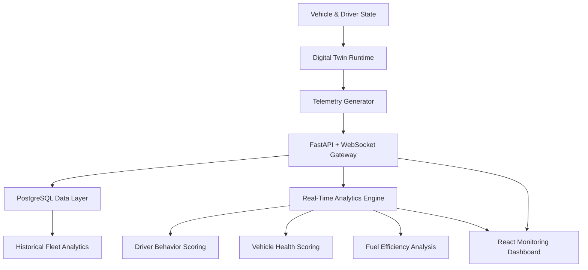

 

 

 

## About

CS student building systems at the intersection of **software engineering**, **AI/information retrieval**, and **empirical evaluation** — with an emphasis on measuring what works.

- **Rigorous system design:** Architecture that holds up under real constraints (SOLID, DI, testability)
- **Empirical measurement:** Not assuming what works — building instruments to measure it (IR evaluation, statistical testing, ablation studies)
- **Honest reporting:** When a hypothesis fails, analyze why and document it (graph-RAG negative result, threats to validity)
- **Software engineering discipline:** Modular boundaries, automated testing (430+ tests), concurrency safety, reproducibility
- **Information Retrieval:** Hybrid retrieval, ranking, RAG grounding, evaluation methodology — building retrieval systems that must be measured to be trusted

 

---

## Flagship Project — DriveVitals

**Fleet Intelligence & Digital Twin Platform — the project I built to solve real operational problems.**

DriveVitals doesn't display vehicle data after the fact — it runs a live digital twin of every vehicle and driver in a fleet, then pushes that twin through an analytics layer to produce decisions a fleet manager can act on immediately.

**Engineering problem:** commercial fleet operators make maintenance, safety, and efficiency decisions on stale, aggregated reports. The gap between what's happening on the road and what's visible to a dispatcher is the problem.

**Approach:** a simulation runtime maintains per-vehicle and per-driver state as a digital twin — physics-based vehicle behavior, driver decision modeling, and telemetry generation — decoupled from the analytics and presentation layers so each can evolve independently.

**Architecture decisions:**
- Modular backend (Python, FastAPI, WebSockets, PostgreSQL) separating simulation, analytics, and API layers
- Relational data model covering fleet operations, historical telemetry, trip management, driver performance, and vehicle health — designed with headroom for predictive maintenance features
- SOLID principles and dependency injection throughout, so OBD-II hardware integration and ML-based scoring can be added without touching the simulation core
- Feature-branch Git workflow with reviewed PRs and controlled integration, run across a team of three developers I lead

**Outcome:** a functioning digital twin runtime with real-time telemetry streaming, live analytics, and a monitoring dashboard — architected from the start to absorb real OBD-II hardware and predictive-maintenance models as the next milestone.

`Python` `FastAPI` `WebSockets` `React` `PostgreSQL` `SQLAlchemy` `Pydantic`

**[→ View Repository](https://github.com/harisrana-dev/DriveVitals)**

 

---

## Featured Project — Nexus

**Local-first AI knowledge and Information Retrieval system for engineering teams.**

Nexus turns personal knowledge (Obsidian vaults, Git activity, engineering documentation) into a continuously searchable knowledge base — with hybrid retrieval grounded in empirical evaluation.

**Why it matters:** Retrieval quality must be measured to be trusted. Nexus includes a research-oriented evaluation laboratory (109 documents, 1,857 chunks, 218 queries across 6 categories) with statistical testing, ablation studies, and honest reporting of negative findings.

### Key Capabilities

- **Hybrid retrieval:** Semantic vector search (MiniLM ONNX) fused with punctuation-tolerant lexical matching via Reciprocal Rank Fusion — significantly outperforms either strategy alone (NDCG@5: 0.498 vs 0.418/0.415, Wilcoxon p<0.001)
- **Git-aware indexing:** Post-commit hook captures commits, generates summaries, writes them back to vault, indexes automatically — knowledge base self-updates
- **Empirical evaluation:** RRF K ablation (K ∈ [5, 200], stable), chunk-size ablation (precision/recall tradeoff), graph-RAG experiment with controlled negative result, human evaluation framework
- **Grounded RAG:** Context construction with source attribution, explicit anti-hallucination rules, multiple LLM providers (Ollama local, Groq/OpenRouter cloud)
- **Reproducible science:** All experiments runnable from committed artifacts; deterministic evaluation; documented limitations and threats to validity
- **Interfaces:** Textual terminal TUI (slash commands, history), Streamlit web UI, asynchronous background operations
- **Engineering rigor:** 430+ automated tests (fully offline, no API calls), file-lock safety, dependency injection, modular architecture

### Research Findings

**Finding 1 — Hybrid RRF significantly outperforms individual strategies.**
Semantic and lexical retrieval each achieve NDCG@5 of ~0.42. Hybrid fusion reaches 0.498 — a 19% improvement. Improvement over semantic is statistically significant (Wilcoxon p<0.001).

**Finding 2 — RRF constant K is stable.**
Performance remains consistent across K ∈ [5, 200]; production default K=60 is near-optimal.

**Finding 3 — Graph augmentation via wikilinks degrades retrieval.**
Counter to the graph-RAG hypothesis, expansion reduced NDCG@5 from 0.498 to 0.467 (p<0.001). Analysis shows sparse connectivity (93 links / 109 docs), navigational vs semantic mismatch, and controlled ablation confirms monotonic degradation. This negative result demonstrates rigorous experimental discipline — measure a hypothesis and report what you find, even when it's unfavorable.

**Limitations:** Synthetic query generation may introduce term-overlap bias; single embedding model; relatively small corpus; sparse Wikilink graph; incomplete human relevance annotations.

### Repository & Documentation

- **Code:** https://github.com/harisrana-dev/nexus
- **Research paper:** [docs/paper/phase3-ir-evaluation.md](https://github.com/harisrana-dev/nexus/blob/main/docs/paper/phase3-ir-evaluation.md)
- **Evaluation artifacts:** Committed datasets, results, figures, full reproducibility instructions

`Python` `FastAPI` `Streamlit` `Textual` `RAG` `Information Retrieval` `ONNX` `Embedding` `RRF` `Statistical Testing` `Empirical Evaluation`

 

---

## Supporting Projects

<table>
<tr>
<td width="50%" valign="top">

**[Smart Door Security System](https://github.com/harisrana-dev)**

Embedded facial authentication pipeline (detection → encoding → recognition) with liveness verification via head-pose analysis and randomized prompts. GPIO door control with PIN fallback and event logging — optimized for CPU-only, frame-skipped inference on a Raspberry Pi.

`Python` `OpenCV` `Raspberry Pi` `Computer Vision`

</td>
<td width="50%" valign="top">

**[Vehicle Service Workshop Database](https://github.com/harisrana-dev)**

Normalized relational schema (1NF–3NF) for workshop operations: customers, vehicles, repairs, inventory, payments. SQL views and reports supporting service history and workshop analytics.

`SQL` `MySQL` `Database Design`

</td>
</tr>
</table>

 

---

## Engineering Principles

- **Model the world before optimizing it.** A dashboard, score, or prediction is only as trustworthy as the state model underneath it — get the model right first.
- **Architecture is a team tool, not an aesthetic.** SOLID and modular boundaries exist so three engineers can move independently without corrupting each other's work.
- **Real-time systems don't forgive patched-on discipline.** You can't retrofit a good state model onto a system that was never designed to hold one.
- **Design for the next integration, not just the current feature.** DriveVitals' architecture assumes OBD-II and ML scoring before either exists; Nexus assumes new models before they're added.
- **Intelligence is only useful once it's connected back to reality.** A retrieval system that doesn't stay synced to real project history, or a twin that doesn't reflect real telemetry, is just a demo.

 

---

## Current Engineering Focus

- [x] Digital twin runtime — simulation orchestration, vehicle control, driver decision-making
- [x] FastAPI + WebSocket backend with PostgreSQL data layer for DriveVitals
- [x] React-based real-time fleet monitoring dashboard
- [x] RAG ingestion pipeline + automated commit-to-notes sync for Nexus
- [ ] OBD-II hardware integration for live telemetry capture
- [ ] Predictive maintenance models on top of DriveVitals' historical telemetry
- [ ] Multi-model extensibility for Nexus's generation layer
- [ ] Edge-deployed inference for real-time computer vision workloads

 

---

## Technical Stack

### Languages & Core
   

Algorithms · Data Structures · OOP · System Design · Software Architecture

### AI & Information Retrieval
   

Hybrid Retrieval · RRF Fusion · Ranking · LLM APIs · Grounding · Statistical Testing · Empirical Evaluation

### Backend & Data
   

REST APIs · WebSockets · Relational Modeling · Query Optimization · Vector Databases

### Frontend & Interfaces
  

Real-Time Dashboards · Terminal UIs · Interactive Applications

### Engineering & DevOps
   

SOLID Principles · Dependency Injection · Testing · CI/CD · Reproducibility

 

---

## Research & Technical Interests

Building systems requires understanding what they can and cannot do. My focus areas:

- **Information Retrieval:** Hybrid retrieval strategies, ranking quality, embedding models, evaluation metrics, statistical testing
- **Retrieval-Augmented Generation (RAG):** Grounding LLM generation in retrieval results, context quality, source attribution, hallucination prevention
- **Empirical Evaluation:** Designing retrieval benchmarks, ablation studies, reproducible experiments, honest reporting of limitations
- **AI Systems:** Embedding quality, local-first execution, multi-provider LLM support, inference efficiency
- **Software Engineering:** Modular architecture, concurrent/distributed safety, comprehensive testing, maintainability at scale

The common thread: **build systems that work in practice → measure them rigorously → understand their limits → improve them iteratively.**

 

---

## Education

**BSCS**, University of Lahore — CGPA 3.66/4.00, expected June 2027

**Elements of AI**, University of Helsinki & MinnaLearn — July 2025

 

---

### Get in Touch

