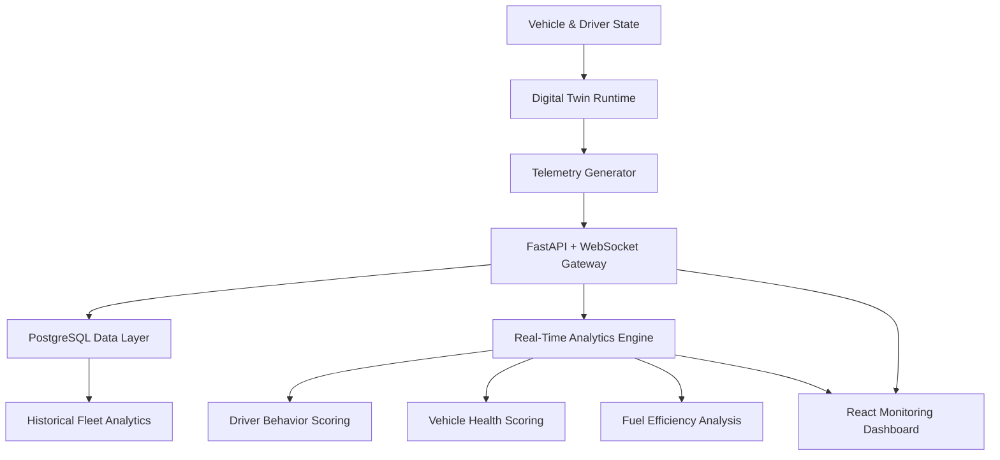
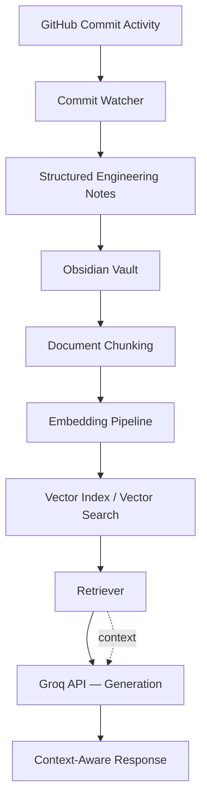

 

 

 

## Engineering Narrative

I build software that has to answer to the physical world. Not dashboards that describe machines after the fact — live models that stay honest to what a vehicle, a driver, or a document collection is actually doing right now, and that hold up when a decision gets made on top of them.

That's the thread connecting everything below. **DriveVitals** models fleets as digital twins so operational decisions are grounded in simulated reality rather than stale reports. The **AI Knowledge Platform** does the same thing for engineering knowledge — instead of a static wiki, it's a retrieval system that stays synchronized with what I actually build and can answer questions about it. Different domains, same discipline: define the state, model it faithfully, and let intelligence sit on top of a foundation that won't lie to you.

I care more about whether a system's architecture will still make sense a year from now than whether it demos well today. SOLID principles, dependency injection, and modular boundaries aren't checkboxes — they're what let three people work on DriveVitals without stepping on each other, and what let the Knowledge Platform's ingestion, retrieval, and generation layers evolve independently.

 

## Systems I Build

| Layer | What happens here |
|:---:|:---|
| **Physical / Knowledge Source** | Vehicles, drivers, roads, mechanical wear · Engineering notes, commits, documents |
| ↓ | |
| **Signal Capture** | Telemetry: speed, RPM, load, temperature · Ingestion: chunking, embeddings, commit activity |
| ↓ | |
| **Modeling Layer** | Digital twin state (vehicle + driver) · Vector index (semantic document space) |
| ↓ | |
| **Intelligence Layer** | Behavior scoring, health scoring, anomaly detection · Context-aware retrieval + generation |
| ↓ | |
| **Decision Output** | Maintenance, safety, efficiency actions | Answers grounded in real engineering history |

 

## Flagship Projects

### DriveVitals — Fleet Intelligence & Digital Twin Platform

DriveVitals doesn't display vehicle data after the fact — it runs a live digital twin of every vehicle and driver in a fleet, then pushes that twin through an analytics layer to produce decisions a fleet manager can act on immediately.

**Engineering problem:** commercial fleet operators make maintenance, safety, and efficiency decisions on stale, aggregated reports. The gap between what's happening on the road and what's visible to a dispatcher is the problem.

**Approach:** a simulation runtime maintains per-vehicle and per-driver state as a digital twin — physics-based vehicle behavior, driver decision modeling, and telemetry generation — decoupled from the analytics and presentation layers so each can evolve independently.

**Architecture decisions:**
- Modular backend (Python, FastAPI, WebSockets, PostgreSQL) separating simulation, analytics, and API layers
- Relational data model covering fleet operations, historical telemetry, trip management, driver performance, and vehicle health — designed with headroom for predictive maintenance features
- SOLID principles and dependency injection throughout, so OBD-II hardware integration and ML-based scoring can be added without touching the simulation core
- Feature-branch Git workflow with reviewed PRs and controlled integration, run across a team of three developers I lead

**Outcome:** a functioning digital twin runtime with real-time telemetry streaming, live analytics, and a monitoring dashboard — architected from the start to absorb real OBD-II hardware and predictive-maintenance models as the next milestone.

`Python` `FastAPI` `WebSockets` `React` `PostgreSQL` `SQLAlchemy` `Pydantic`

**[→ View Repository](https://github.com/harisrana-dev/DriveVitals)**

 

### AI Knowledge Platform — RAG Over a Living Engineering Knowledge Base

A retrieval-augmented system that turns a personal Obsidian vault and live GitHub activity into a queryable engineering brain — answers stay grounded in what I've actually built, not in a generic model's memory.

**Engineering problem:** engineering knowledge decays the moment it's written down. Notes go stale, context gets lost across projects, and a static wiki doesn't know what changed last week.

**Approach:** an ingestion pipeline chunks and embeds documents into a vector index; a commit watcher converts ongoing GitHub activity into structured notes and writes them back into the vault automatically, so the knowledge base updates itself as the underlying projects move.

**Architecture decisions:**
- Clean separation of ingestion, indexing, retrieval, and generation, deliberately built for multi-model extensibility rather than locked to one provider
- Automated commit-to-notes pipeline closes the loop between "what I built" and "what the system knows," instead of relying on manual documentation
- Vector search over chunked embeddings keeps retrieval grounded and context-aware rather than relying on generation alone

**Outcome:** a self-updating knowledge system where engineering questions about my own projects get answered from real project history, not from an LLM's general priors.

`Python` `Streamlit` `Groq API` `RAG` `Vector Search`

**[→ View Repository](https://github.com/harisrana-dev/ai-knowledge-platform)**

 

## Supporting Projects

<table>
<tr>
<td width="50%" valign="top">

**Smart Door Security System**

**Problem:** consumer-grade facial recognition access control is trivially spoofed with a photo.
**Approach:** real-time facial authentication pipeline (detection → encoding → recognition) combined with head-pose-based liveness verification using randomized prompts, plus GPIO door control with a PIN fallback and event logging — optimized for CPU-only, frame-skipped asynchronous inference on a Raspberry Pi.

`Python` `OpenCV` `Raspberry Pi` `NumPy` `Computer Vision`

</td>
<td width="50%" valign="top">

**Vehicle Service Workshop Management Database**

**Problem:** workshop operations (customers, vehicles, repairs, inventory, payments) break down without a properly normalized data model.
**Approach:** relational schema normalized through 1NF–3NF with foreign-key constraints and indexing strategy, plus SQL views and reports supporting service history and workshop analytics.

`SQL` `MySQL` `Database Design` `Relational Modeling`

</td>
</tr>
</table>

 

## Engineering Principles

- **Model the world before optimizing it.** A dashboard, score, or prediction is only as trustworthy as the state model underneath it — get the model right first.
- **Architecture is a team tool, not an aesthetic.** SOLID and modular boundaries exist so three engineers can move independently without corrupting each other's work.
- **Real-time systems don't forgive patched-on discipline.** You can't retrofit a good state model onto a system that was never designed to hold one.
- **Design for the next integration, not just the current feature.** DriveVitals' architecture assumes OBD-II and ML scoring before either exists; the Knowledge Platform assumes new models before they're added.
- **Intelligence is only useful once it's connected back to reality.** A retrieval system that doesn't stay synced to real project history, or a twin that doesn't reflect real telemetry, is just a demo.

 

## Current Engineering Focus

- [x] Digital twin runtime — simulation orchestration, vehicle control, driver decision-making
- [x] FastAPI + WebSocket backend with PostgreSQL data layer for DriveVitals
- [x] React-based real-time fleet monitoring dashboard
- [x] RAG ingestion pipeline + automated commit-to-notes sync for AI Knowledge Platform
- [ ] OBD-II hardware integration for live telemetry capture
- [ ] Predictive maintenance models on top of DriveVitals' historical telemetry
- [ ] Multi-model extensibility for the AI Knowledge Platform's generation layer
- [ ] Edge-deployed inference for real-time computer vision workloads

 

## Featured Repositories

<table>
<tr>
<td width="50%" valign="top">

**[DriveVitals](https://github.com/harisrana-dev/DriveVitals)**
Digital twin and fleet intelligence platform — real-time vehicle/driver simulation, telemetry streaming, and analytics.
`Python` `FastAPI` `WebSockets` `PostgreSQL` `React`

</td>
<td width="50%" valign="top">

**[AI Knowledge Platform](https://github.com/harisrana-dev/ai-knowledge-platform)**
RAG system over a self-updating Obsidian knowledge base, synced from live GitHub activity.
`Python` `Streamlit` `Groq API` `RAG`

</td>
</tr>
<tr>
<td width="50%" valign="top">

**[Smart Door Security System](https://github.com/harisrana-dev)**
Embedded facial-recognition access control with liveness detection on Raspberry Pi.
`Python` `OpenCV` `Raspberry Pi`

</td>
<td width="50%" valign="top">

**[Vehicle Service Workshop DB](https://github.com/harisrana-dev)**
Normalized relational database and reporting layer for workshop operations.
`SQL` `MySQL` `Database Design`

</td>
</tr>
</table>

 

## Technical Capabilities

<table>
<tr>
<td valign="top" width="25%">

**Core Engineering**

Algorithms · Data Structures · OOP · System Design

</td>
<td valign="top" width="25%">

**Intelligent Systems**

RAG · Vector Search · LLM Integration · Computer Vision · Digital Twins · Vehicle Telemetry

</td>
<td valign="top" width="25%">

**Infrastructure**

Relational Modeling · Query Optimization · Embedded Deployment

</td>
<td valign="top" width="25%">

**Software Engineering**

REST APIs · SOLID · Design Patterns · Dependency Injection · Agile

</td>
</tr>
</table>

 

## Research Direction

`Digital Twin Simulation Fidelity` · `Fleet Intelligence` · `Automotive AI` · `Predictive Vehicle Diagnostics` · `Predictive Maintenance` · `Edge AI` · `Real-Time Computer Vision` · `Intelligent Automotive Systems`

 

## Education

**BSCS**, University of Lahore — CGPA 3.66/4.00, expected June 2027
**Elements of AI**, University of Helsinki & MinnaLearn — July 2025

 

### Get in Touch

